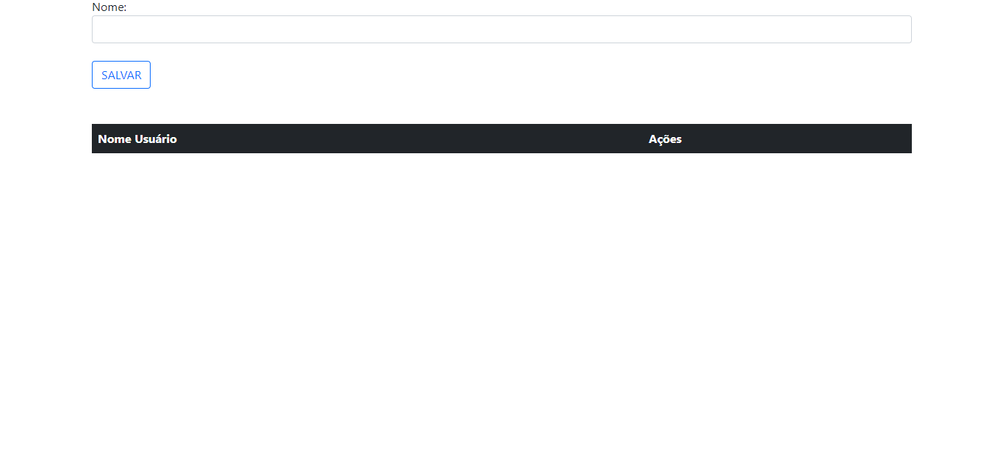

## Lofin-Cad
Nessa atividade nós criamos uma página de Login e cadastro onde ao fazer login no site ele nos direciona a página de cadastro, nele conseguimos cadastrar algo editar-lo e exclui-lo o.

## Explicações das funções em JavaScript

 * ``element``  É uma referência a um objeto ``Element``, ou null se um elemento com o ID especificado não estiver contido neste documento.
 
 * ``id``   É uma string que diferência maiúsculas e minúsculas representando o ID único do elemento sendo procurado.
 * ``Push``   O método push() adiciona um ou mais elementos ao final de um array e retorna o novo comprimento desse array.
 * ``Splice``   O método splice() altera o conteúdo de uma lista, adicionando novos elementos enquanto remove elementos antigos.

 * ``window.location.href`` Ele direciona para outra página 

 * ``parentNode``

 * ``rowIndex``

 * ``value`` Adiciona um valor a

 ## Função "acessar"

 ### Código

**Objetivo:** Validar se os campos de login foram preenchidos e, se sim, redirecionar para outra página.

* Explicações: 
* Obtém os valores dos campos de entrada de email e senha.
* Verifica se ambos os campos estão preenchidos.
* Se algum campo estiver vazio, exibe um alerta.
* Se ambos os campos estiverem preenchidos, redireciona para "cadastro.html". 

## Projeto final

## Tecnologias
 

 
   
   
   
 

 
 
##
 
## Quer me conhecer?
 

   
   
    

