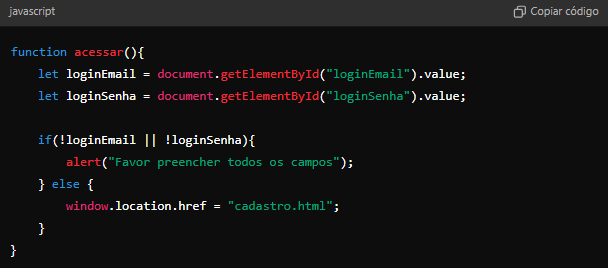
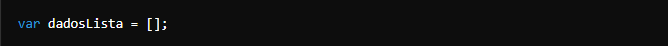
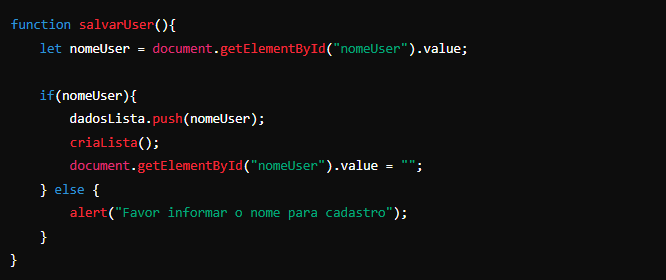
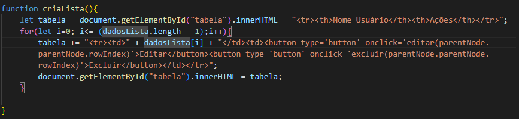
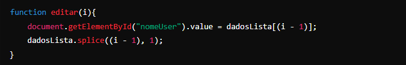
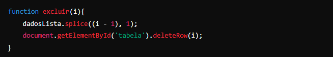
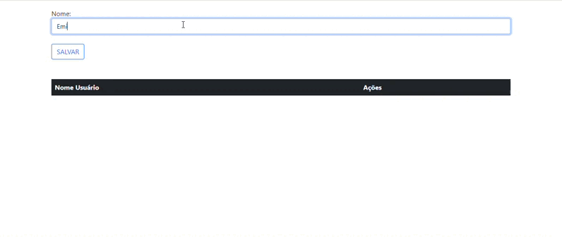

## Página de Login e Cadastro
Nessa atividade nós criamos uma página de Login e Cadastro onde ao fazer login na página inicial ele nos direciona a página de cadastro, nele conseguimos cadastrar algo editar-lo e exclui-lo o.

## Explicações das funções e elementos em JavaScript

 * ``element``  É uma referência a um objeto ``Element``, ou null se um elemento com o ID especificado não estiver contido neste documento.
 
 * ``id``   É uma string que diferência maiúsculas e minúsculas representando o ID único do elemento sendo procurado.
 * ``Push``   O método push() adiciona um ou mais elementos ao final de um array e retorna o novo comprimento desse array.
 * ``Splice``   O método splice() altera o conteúdo de uma lista, adicionando novos elementos enquanto remove elementos antigos.

 * ``window.location.href`` Ele direciona para outra página ou seja propriedade retorna o URL da página atual.

 * ``parentNode`` O parentNode (que se traduzirmos literalmente significa "nó pai") é uma propriedade de um objeto do tipo Node , que representa um nó em uma árvore de elementos HTML, essa propriedade é utilizada para acessar o nó pai de um elemento.

 * ``rowIndex`` Retorna a posição de uma linha na coleção de linhas de uma tabela.

 * ``getElementById`` Método da ``Document`` interface retorna um ``Element`` objeto que representa o elemento cuja ``id`` propriedade corresponde à ``string`` especificada.

 * `` Var `` Declara uma variável, opcionalmente é possível atribuir à ela um valor em sua inicialização.

 * ``let`` Permite que você declare variáveis limitando seu escopo no bloco, instrução, ou em uma expressão na qual ela é usada. Isso é inverso da keyword ``var``, que define uma variável globalmente ou no escopo inteiro de uma função, independentemente do escopo de bloco.

 * ``for`` A declaração ``for`` começa declarando a variável ``i`` e inicializando-a como ``0``. Ela verifica se ``i`` é menor que nove, executa as duas instruções subsequentes e incrementa 1 a variável ``i`` após cada passagem pelo loop.

 * `` Function `` objeto fornece métodos para ``funções``. Em JavaScript, cada função é, na verdade, um ``Function`` objeto.

 * ``innerHTML`` Propriedade define ou retorna o conteúdo HTML (HTML interno) de um elemento.

 ## **Explicação do código em partes**

 ### Parte 1 - Código Função ``acessar``

**Objetivo:** Validar se os campos de login foram preenchidos e, se sim, redirecionar para outra página.

* **Explicações:** 
* Obtém os valores dos campos de entrada de email e senha.
* Verifica se ambos os campos estão preenchidos.
* Se algum campo estiver vazio, exibe um alerta.
* Se ambos os campos estiverem preenchidos, redireciona para "cadastro.html". 

### Parte 2 - ``dadosLista``

* **Explicação**
``dadosLista`` é um array, ele armazena uma lista de nomes inseridos pelo usuário.

### Parte 3 - ``salvarUser``

* **Explicação:**
* **Objetivo:** Adicionar o nome inserido pelo usuário ao array ``dadosLista`` e atualizar a tabela com a lista de nomes.
* **Detalhes:**
``document.getElementById("nomeUser").value`` obtém o valor do campo de nome.
Se o campo não estiver vazio, o nome é adicionado ao array ``dadosLista`` e a função ``criaLista()`` é chamada para atualizar a tabela.
Após adicionar o nome, o campo é limpo ``(document.getElementById("nomeUser").value = "")``.
Se o campo estiver vazio, um alerta é mostrado pedindo para preencher o nome.

### Parte 4 - ``criarLista``

* **Explicação:**
* **Objetivo:** Criar e atualizar uma tabela HTML com a lista de nomes.
* **Detalhes:**
A variável tabela começa com o cabeçalho da tabela.
Um loop for percorre ``dadosLista`` e cria uma linha para cada nome. Cada linha inclui dois botões: ``"Editar"`` e ``"Excluir"``.
``parentNode.parentNode.rowIndex`` é usado para passar o índice da linha ao chamar as funções editar e excluir.
O conteúdo HTML da tabela é atualizado com a nova linha.

### Parte 5 - ``Editar``

* **Explicação:**
* **Objetivo:** Editar um nome da lista.
* **Detalhes:**
Preenche o campo de nome com o nome selecionado da tabela ``(dadosLista[(i - 1)])``.
Remove o nome da lista ``(dadosLista.splice((i - 1), 1))``, permitindo que o usuário edite o nome e o adicione novamente.

### Parte 6 - ``Excluir``

* **Explicação:**
* **Objetivo:** Excluir um nome da lista e da tabela.
* **Detalhes:**
Remove o nome da lista ``(dadosLista.splice((i - 1), 1))``.
Remove a linha correspondente da tabela HTML ``(document.getElementById('tabela').deleteRow(i))``.

## Cadastro Projeto final 

## Tecnologias
 

 
   
   
   
 

 
 
##
 
## Quer me conhecer?
 

   
   
    

